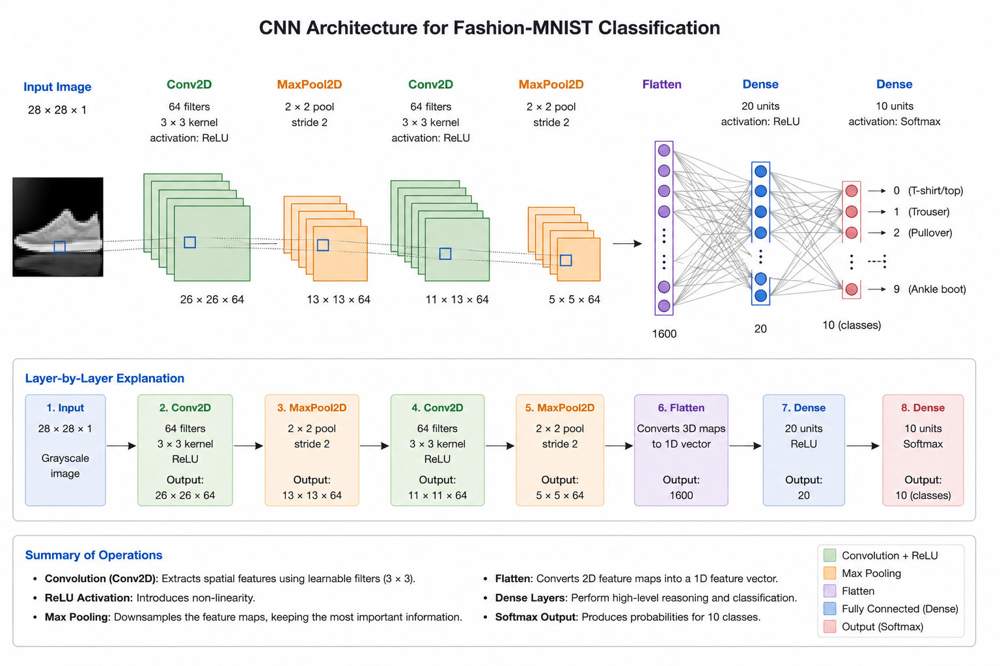

# Convolutions and Pooling — TinyML Assignment



This assignment demonstrates the basics of **convolutions** and **pooling** in image processing, which are foundational concepts for Convolutional Neural Networks (CNNs).

---

## What are Convolutions?
A **convolution** is a mathematical operation that applies a filter (also called a kernel) to an image. The filter slides over the image, multiplying and summing pixel values to highlight specific features (like edges or lines). This helps neural networks learn patterns that are spatially local and translation-invariant.

- Example: Edge detection filters can highlight vertical or horizontal lines in an image.

## What is Pooling?
**Pooling** is a technique to reduce the spatial size of an image while preserving important features. The most common type is **max pooling**, which replaces a block of pixels with their maximum value. This reduces computation and helps the network focus on the most prominent features.

---

## What does the code do?
1. Loads a sample grayscale image (stairwell) from `scipy`.
2. Applies a 3×3 convolution filter to detect edges (you can try different filters for different effects).
3. Visualizes the result after convolution.
4. Applies 4×4 max pooling to compress the image, keeping only the strongest features.
5. Visualizes the pooled image.

---

## How to run

```bash
pip install numpy matplotlib scipy opencv-python
python convolutions_and_pooling.py
```

---

## Files
```
Convolutions/
├── convolutions_and_pooling.py   # The assignment script
└── README.md                     # This file
```
